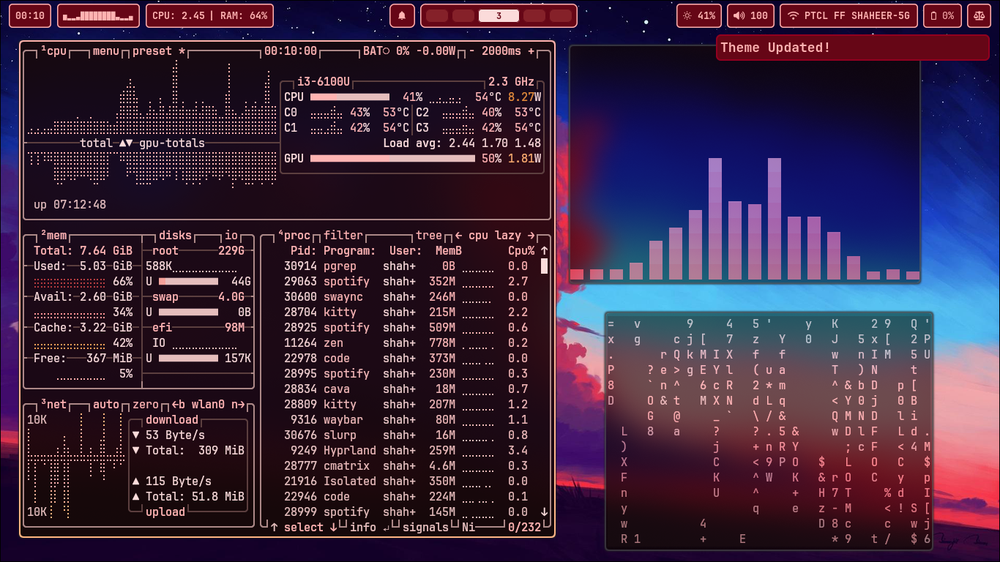
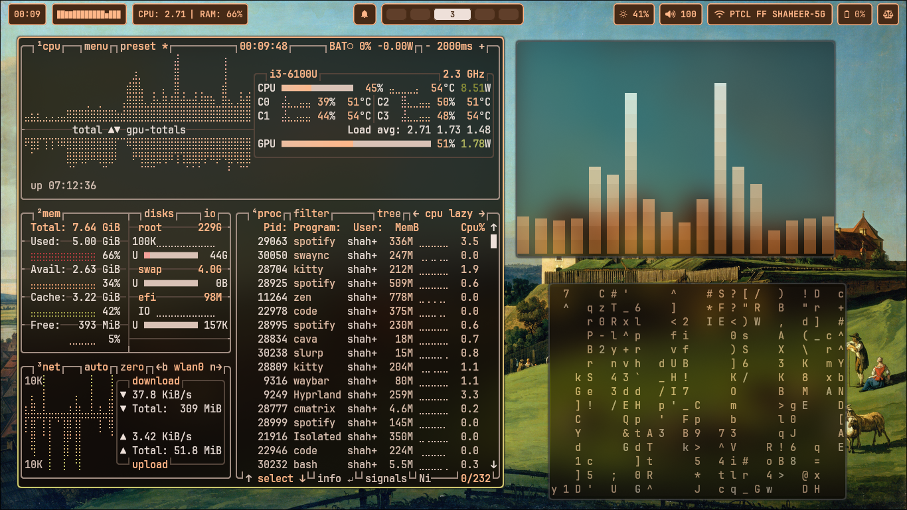
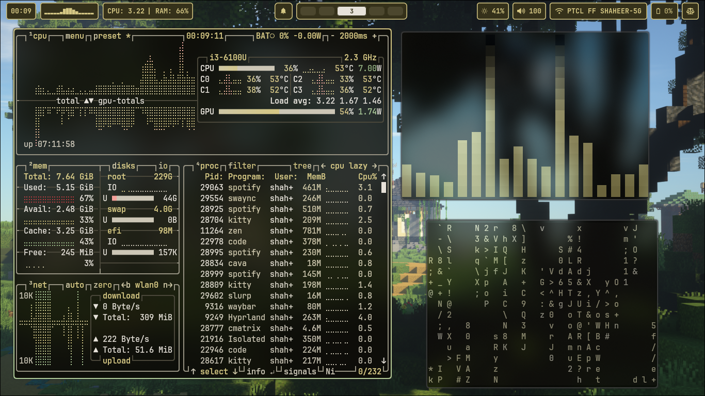
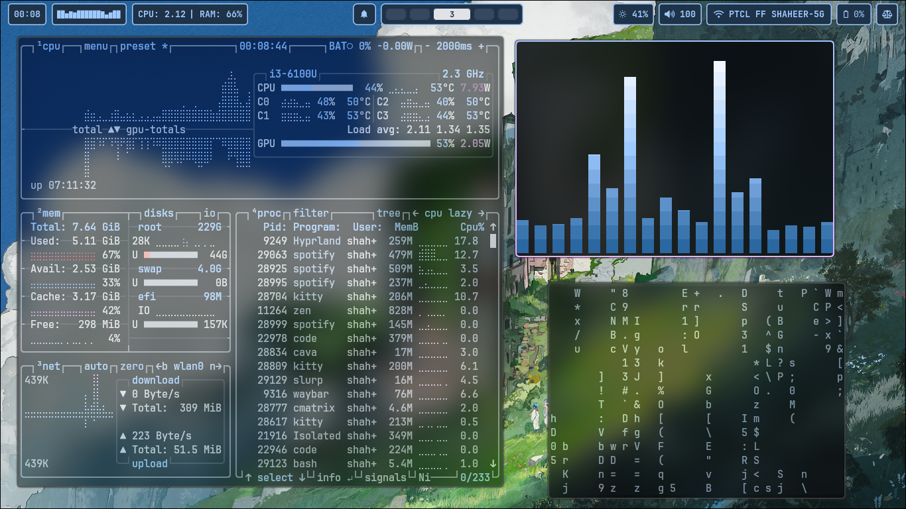
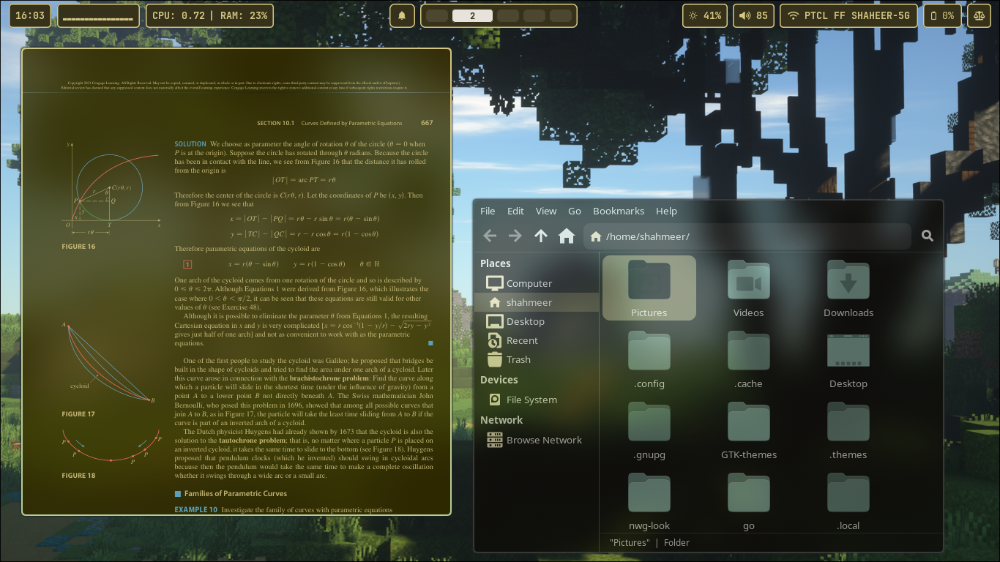
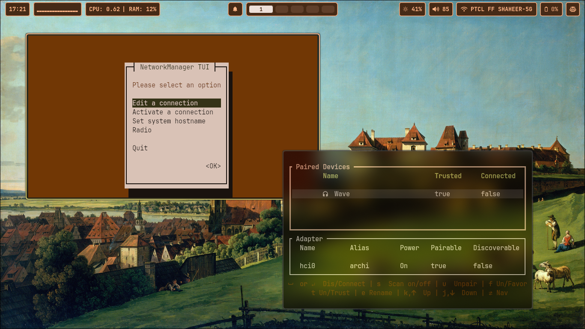
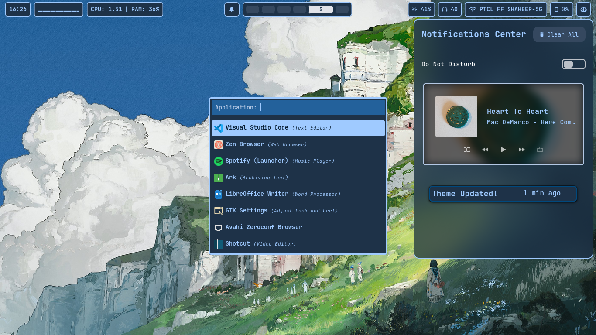
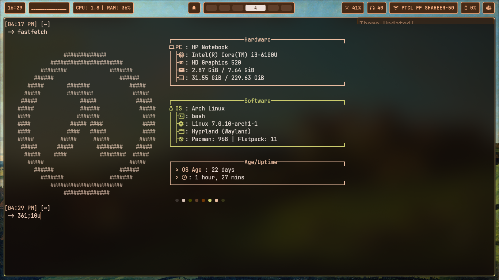
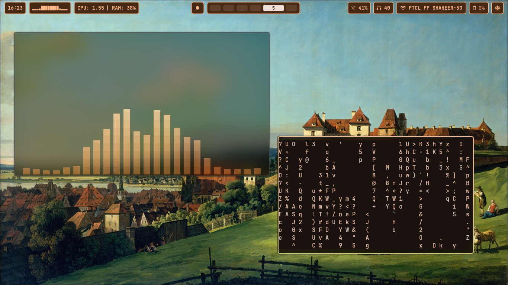
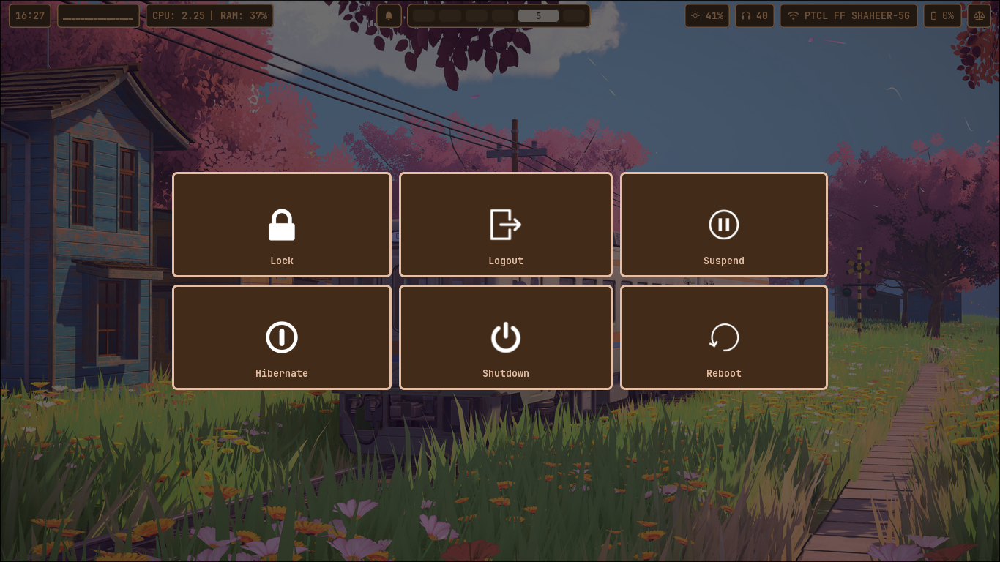

#   Hyprland Dotfiles 

## Overview
This repo consits of my personal dotfiles for hyprland on Arch linux.
The setup is build around a dynamic wallpaper theming using [Matugen](https://github.com/InioX/matugen) with a custom wallpaper switcher script using rofi.

## Preview of my configuration
### Dynamic Theming

These are some previews of how matugen is used to dynamicaly theme the desktop. I use `` matugen -t scheme-content --prefer saturation image $WallDir/$SELECTION `` which is inside of the ``rofi_wallpaper_switcher.sh``. 

If you wish to learn more about this I recommend you offical repo for [Matugen](https://github.com/InioX/matugen)

<table>
  <tr>
    <td width="50%"></td>
    <td width="50%"></td>
  </tr>
  <tr>
    <td width="50%"></td>
    <td width="50%"></td>
  </tr>
</table>

### A custom Wallpaper switcher

For the wallpaper switcher I use ``rofi -dmenu`` and then displaying the images as icons. If you wish to learn more about this vist [Rofi Dmenu markdown](https://github.com/davatorium/rofi/blob/next/doc/rofi-dmenu.5.markdown)

### A preview of the desktop as a whole

<tr>
    <td width="50%"></td>
    <td width="50%"></td>
  </tr>
  <tr>
    <td width="50%"></td>
    <td width="50%"></td>
  </tr>
  <tr>
    <td width="50%"></td>
    <td width="50%"></td>
  </tr>
</table>

# Prerequisites

Unfortunately as of right now I dont have a installer script for the rice but hope to create one in the future. Thus, you would need to have a few thigs already in your system for it to work out of the box

* Waybar
* Rofi
* swaync
* nmtui
* bluetui
* wlogout
* thunar
* matugen (Very imp as used for dynamic theming)
* zen browser
* hyprshot

>[!NOTE]
>For the ``malwareCheck.sh`` its used for arch linux scanning through your packages and giving you a list of packages infected. I would also like to note that I am not the creater of the script but it from a [Reddit Post](https://www.reddit.com/r/linuxmemes/comments/1u9cilx/is_it_safe_to_update_yet/)

# Keybinds

| KeyBinds  | Description |
| ----------- | --------------- |
| <kbd>SUPER</kbd> + <kbd>ENTER</kbd>  | Open Kitty  |
| <kbd>SUPER</kbd> + <kbd>ENTER</kbd> + <kbd>SHIFT</kbd>  |  Open Floating Terminal |
| <kbd>SUPER</kbd> + <kbd>0-9</kbd> | Move to workspace 0-9|
| <kbd>SUPER</kbd> + <kbd>SHIFT</kbd> + <kbd>0-9</kbd> | Move Active Window to Workspace 0-9|
| <kbd>SUPER</kbd> + <kbd>SHIFT</kbd> + <kbd>U</kbd>   | Open and exist special Workspace |
| <kbd>ALT</kbd>   + <kbd>TAB</kbd> | Cycle to next window |
| <kbd>SUPER</kbd> + <kbd>TAB</kbd> | Shift places with the next window |
| <kbd>SUPER</kbd> + <kbd>E</kbd> | Open File manager  |
| <kbd>SUPER</kbd> + <kbd>B</kde> | Open browser |
| <kbd>SUPER</kbd> + <kbd>D</kbd> | Open appication Launcher |
| <kbd>SUPER</kbd> + <kbd>W</kbd> | Open Wallpaper switcher |
| <kbd>SUPER</kbd> + <kbd>M</kbd> | Open Login Manger |
| <kbd>SUPER</kbd> + <kbd>R</kbd> | Reload Waybar and Swaync |
| <kbd>SUPER</kbd> + <kbd>Q</kbd> | Quit Active Window |
| <kbd>SUPER</kbd> + <kbd>ESC</kbd> | Open Logout manager |
| <kbd>SUPER</kbd> + <kbd>PRT SC</kbd> | Take screen shot of a window |
| <kbd>SUPER</kbd> + <kbd>CTRL</kbd>   | Take screen shot of region |

## Submap

I have a ``kitty`` submap which allows me to open things like ``nmtui``, ``bluetui`` and ``cava``

To enter in the submap press <kbd>SUPER</kbd> + <kbd>K</kbd>, then:
* <kbd>C</kbd> For cava
* <kbd>N</kbd> For nmtui
* <kbd>B</kbd> For bluetui 

